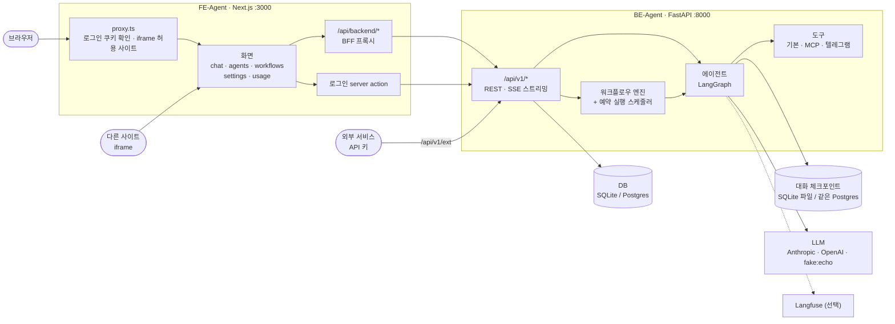
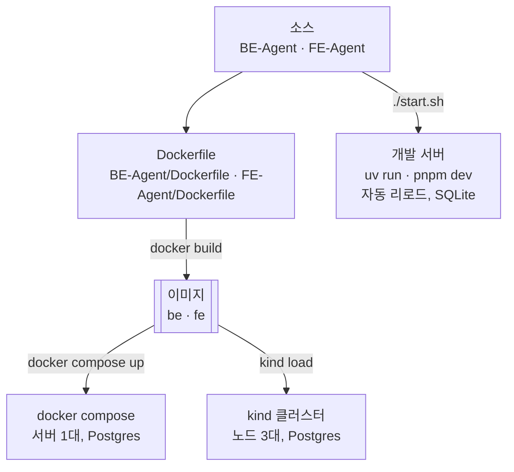
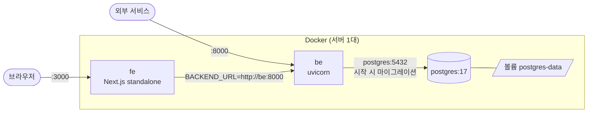
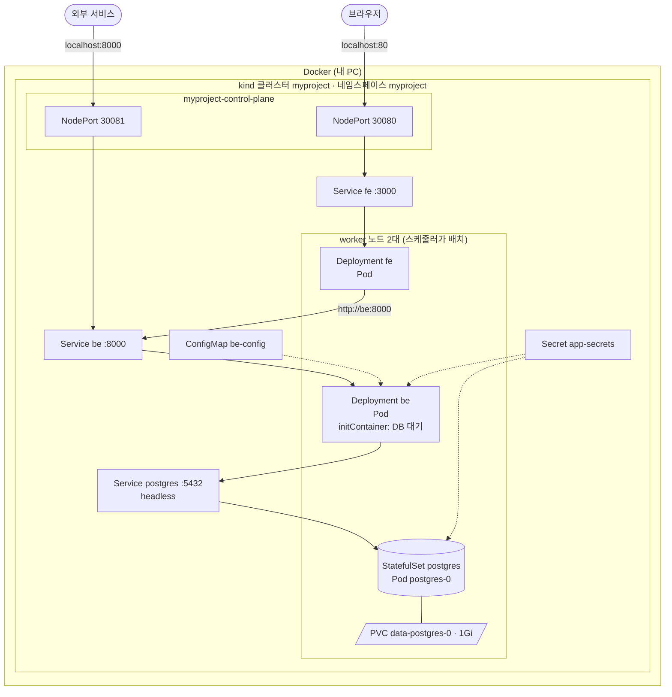
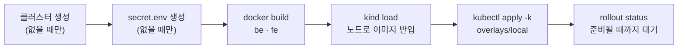

# 구성도

이 워크스페이스의 전체 구조와 실행 방식 세 가지(개발 서버 · docker compose · kind)를 그림으로 정리한다.

## 0. 개발 환경

WSL2 (Ubuntu) 기준. 확인한 버전 (2026-10).

| 구분 | 도구 | 버전 | 설치 |
| --- | --- | --- | --- |
| 백엔드 | uv | 0.12 | `curl -LsSf https://astral.sh/uv/install.sh \| sh` |
| | Python | 3.13 | `uv sync` 가 알아서 받는다 (`BE-Agent/.python-version`) |
| 프론트 | Node.js | 22 | |
| | pnpm | 10 | `npm i -g pnpm` |
| 컨테이너 | Docker Engine | 29 | |
| | docker compose | 2.40 | |
| | docker buildx | 0.37 | `~/.docker/cli-plugins/docker-buildx` (Dockerfile 의 캐시 마운트에 필요) |
| 쿠버네티스 | kind | 0.33 (노드 k8s 1.37) | `~/.local/bin/kind` |
| | kubectl | 1.37 | `~/.local/bin/kubectl` |
| GitHub | gh | 2.102 | `~/.local/bin/gh` (`gh auth login` 으로 git push 인증) |

주요 라이브러리: FastAPI · LangGraph · SQLAlchemy 2 · Alembic / Next.js 16 · React 19

| 포트 | 쓰는 곳 |
| --- | --- |
| 3000 | 프론트 (개발 서버 · compose) |
| 8000 | 백엔드 (세 방식 모두) |
| 80 | 프론트 (kind) |

| 설정 파일 | 쓰는 곳 | 커밋 |
| --- | --- | --- |
| `BE-Agent/.env` | 개발 서버 (백엔드) | ✗ (`.env.example` 만) |
| `FE-Agent/.env.local` | 개발 서버 (프론트) | ✗ (`.env.example` 만) |
| `.env` (루트) | docker compose | ✗ (`.env.example` 만) |
| `k8s/overlays/local/secret.env` | kind | ✗ (`secret.env.example` 만) |

## 1. 앱 구조

브라우저는 프론트(Next.js)만 부른다. 프론트 서버가 BFF 로서 로그인 쿠키의 토큰을 붙여 백엔드를 대신 호출한다.
외부 서비스는 API 키로 백엔드를 직접 부른다.



| 저장소 | 스택 | 주요 폴더 |
| --- | --- | --- |
| BE-Agent | uv · FastAPI · LangGraph · SQLAlchemy · Alembic | `core/` 설정·LLM, `agent/`, `workflow/`, `tools/`, `api/v1/`, `db/`, `migrations/` |
| FE-Agent | Next.js · pnpm · shadcn/ui · React Flow · AI SDK | `app/(main)/` 화면, `app/api/backend/` BFF, `components/`, `lib/api/` |

## 2. 실행 방식 세 가지

세 방식 모두 같은 소스, 그리고 compose·kind 는 **같은 Docker 이미지**를 쓴다. 바뀌는 건 "어떻게 실행하느냐" 뿐이다.



| | 개발 서버 | docker compose | kind (쿠버네티스) |
| --- | --- | --- | --- |
| 용도 | 평소 개발 | 이미지 확인 · 서버 1대 배포 | 쿠버네티스 학습 |
| 켜기 | `./start.sh` | `docker compose up -d --build` | `./k8s/up.sh` |
| 끄기 | `./stop.sh` | `docker compose down` | `./k8s/down.sh` (삭제) |
| 잠깐 멈춤 | — | `docker compose stop` | `docker stop myproject-control-plane myproject-worker myproject-worker2` |
| 화면 | http://localhost:3000 | http://localhost:3000 | http://localhost |
| 백엔드 | http://localhost:8000 | http://localhost:8000 | http://localhost:8000 |
| DB | SQLite (`BE-Agent/data/`) | Postgres (볼륨 `postgres-data`) | Postgres (StatefulSet + PVC) |
| 설정 | `BE-Agent/.env`, `FE-Agent/.env.local` | 루트 `.env` | `k8s/overlays/local/` (`secret.env`) |

> 세 방식은 같은 포트를 쓰므로 **한 번에 하나만** 켠다. 끌 때는 켠 방식의 명령을 쓴다
> (`docker compose down` 은 kind 노드를 내리지 않는다).

## 3. docker compose 구성



- 시작 순서: postgres 가 healthy → be 가 healthy(`/health`) → fe (`depends_on`)
- 비밀값은 루트 `.env` (커밋 제외). 포트는 `BE_PORT` · `FE_PORT` 로 바꿀 수 있다.

## 4. kind (쿠버네티스) 구성

kind 는 Docker 컨테이너를 쿠버네티스 노드로 쓴다. `docker ps` 에는 노드 3개만 보이고, 앱은 그 안의 Pod 로 돈다.



| 리소스 | 하는 일 |
| --- | --- |
| Deployment (be, fe) | 지정한 개수의 Pod 를 유지. 죽으면 다시 띄우고, 이미지가 바뀌면 롤링 업데이트 |
| StatefulSet (postgres) | Pod 이름(`postgres-0`)과 디스크(PVC)를 고정. Pod 를 지워도 같은 데이터로 다시 뜬다 |
| Service | Pod 앞의 고정 주소 · DNS 이름(`be`, `fe`, `postgres`). NodePort 는 노드 포트로 외부에 연다 |
| ConfigMap / Secret | 설정과 비밀값을 환경변수로 넣는다. 이름에 내용 해시가 붙어 값이 바뀌면 Pod 가 새로 뜬다 |
| readiness / liveness | 준비 안 된 Pod 는 트래픽에서 빼고, 응답 없는 컨테이너는 재시작 |

`./k8s/up.sh` 가 하는 일:



```
k8s/
├── kind-cluster.yaml        노드 3대, NodePort ↔ localhost 포트 연결
├── base/                    namespace · postgres · be · fe
├── overlays/local/          ConfigMap·Secret 생성, 이미지 태그(dev), NodePort 노출
├── up.sh                    생성 · 빌드 · 반입 · 배포 (다시 실행하면 재배포)
└── down.sh                  클러스터 삭제
```

## 5. 다음 단계

- **Gateway API**: `localhost` 하나에서 `/api/v1` → be, 나머지 → fe 로 나눠 보내기 (ingress-nginx 는 2026-03 개발 종료)
- **마이그레이션 Job**: be 를 여러 개로 늘려도 마이그레이션이 한 번만 돌게 분리
- **Skaffold**: 코드 수정 → 빌드 → 재배포 자동화
